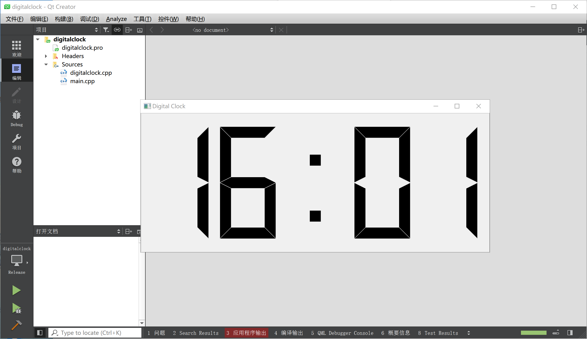

# 如何将QT上编写的C++程序打包成能够独立运行的EXE文件
## 1.编译程序

## 2.打包程序
1.先安装好[Enigma Virtual Box](https://enigmaprotector.com/en/downloads.html)

2.打开Qt自带的命令行程序

如：   
  我这里使用的是：Qt 5.14.1 (MinGW 7.3.0 64-bit)    
  
3.找到你要打包的程序   
如：    
  我这里要打包的程序是   widgets\build-digitalclock-Desktop_Qt_5_14_1_MinGW_64_bit-Release文件夹下的digitalclock.exe。     
  (事实上，如果你直接把这个程序和需要的库文件都放在一个文件夹内的话，在别人的计算机上也是可以运行的，只不过可能你要一个一个去找库文件)      
新建一个文件夹 proj1 将该exe文件放入。      
在QT的命令行程序中输入``cd /d .../.../proj1(该文件夹所在的路径)``,移动到proj1位置     
之后输入 ``windeployqt digitalclock.exe(程序名)``自动将所需的所有库文件放入    

  
然后打开Enigma Virtual Box程序，输入exe的路径，然后输入你要设置的新exe的位置，当然也可以使用默认的位置    

之后需要点击add添加exe所在的文件夹，因为那里有你刚才放进去的所有必需库文件。   

之后点击Process处理就行了。你会在设定的新文件夹位置找到你的打包后的exe文件。   

